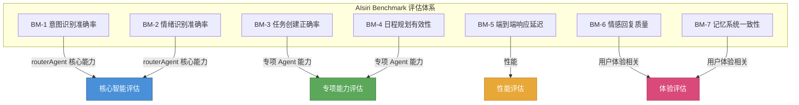
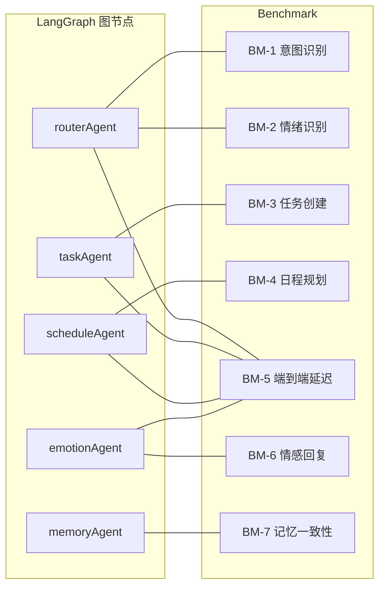
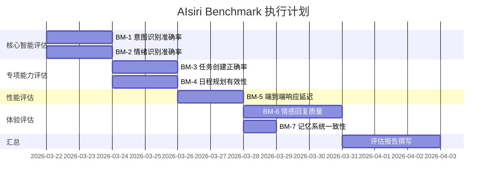

# AIsiri Benchmark 评估体系

> 版本：v1.1 | 日期：2026-03-23 | 基于系统架构分析构建

---

## 一、评估体系总览



### 各 Benchmark 与系统组件映射



---

## 二、BM-1 意图识别准确率

### 评估目标

验证 `routerAgent` 在单次 LLM 调用中对用户输入进行意图分类的准确性。

### 被测组件

| 组件 | 文件 | 模型 | 参数 |
|------|------|------|------|
| routerAgent | `agents/routerAgent.js` | qwen-plus | temp=0.1, maxTokens=800 |

### 评估标准

| 指标 | 公式 | 达标线 | 优秀线 |
|------|------|--------|--------|
| 主意图准确率 (Accuracy) | 正确数 / 总数 | ≥ 85% | ≥ 92% |
| 各类精确率 (Precision) | TP / (TP + FP) | ≥ 80% | ≥ 90% |
| 各类召回率 (Recall) | TP / (TP + FN) | ≥ 80% | ≥ 90% |
| 宏平均 F1 (Macro-F1) | 各类 F1 均值 | ≥ 0.82 | ≥ 0.90 |
| 多意图命中率 | 多意图集合完全匹配 / 多意图总数 | ≥ 70% | ≥ 85% |

### 测试用例设计（40 条，按意图分层采样）

| 意图类型 | 用例数 | 覆盖场景 |
|----------|--------|----------|
| TASK_CREATION | 10 | 单任务、多任务、隐式任务、带时间、不带时间 |
| SCHEDULE_PLANNING | 11 | 查看日程、调整顺序、规划安排、清理重复、时间调整 |
| CONVERSATION | 12 | 闲聊、情绪宣泄、感谢、提问、寒暄、建议咨询 |
| 复合意图 | 7 | 任务+日程、情绪+任务、情绪+日程、三重复合 |

### 详细用例

| 编号 | 输入 | 期望主意图 | 期望全部意图 | 难度 |
|------|------|-----------|-------------|------|
| I-01 | "帮我创建一个明天下午开会的任务" | TASK_CREATION | [TASK_CREATION] | 简单 |
| I-02 | "取快递" | TASK_CREATION | [TASK_CREATION] | 简单 |
| I-03 | "提醒我晚上8点吃药" | TASK_CREATION | [TASK_CREATION] | 简单 |
| I-04 | "周五要交作业" | TASK_CREATION | [TASK_CREATION] | 中等 |
| I-05 | "明天早上6点起床跑步" | TASK_CREATION | [TASK_CREATION] | 简单 |
| I-06 | "买生日礼物，预算500" | TASK_CREATION | [TASK_CREATION] | 中等 |
| I-07 | "论文、PPT、答辩都要搞" | TASK_CREATION | [TASK_CREATION, SCHEDULE_PLANNING] | 困难 |
| I-08 | "我需要完成三个作业" | TASK_CREATION | [TASK_CREATION] | 中等 |
| I-09 | "后天下午3点约了牙医" | TASK_CREATION | [TASK_CREATION] | 简单 |
| I-10 | "帮我记个事情，下周三有面试" | TASK_CREATION | [TASK_CREATION] | 简单 |
| I-11 | "重新安排一下今天的日程" | SCHEDULE_PLANNING | [SCHEDULE_PLANNING] | 简单 |
| I-12 | "帮我看看今天有什么任务" | SCHEDULE_PLANNING | [SCHEDULE_PLANNING] | 简单 |
| I-13 | "把重复的任务清理一下" | SCHEDULE_PLANNING | [SCHEDULE_PLANNING] | 中等 |
| I-14 | "按优先级重新排一下" | SCHEDULE_PLANNING | [SCHEDULE_PLANNING] | 中等 |
| I-15 | "这周的安排能调整吗" | SCHEDULE_PLANNING | [SCHEDULE_PLANNING] | 中等 |
| I-16 | "把明天的会议推迟到下午" | SCHEDULE_PLANNING | [SCHEDULE_PLANNING] | 中等 |
| I-17 | "帮我规划明天的学习安排" | SCHEDULE_PLANNING | [SCHEDULE_PLANNING] | 简单 |
| I-18 | "下周一上午有什么安排" | SCHEDULE_PLANNING | [SCHEDULE_PLANNING] | 简单 |
| I-19 | "下午的安排能提前一小时吗" | SCHEDULE_PLANNING | [SCHEDULE_PLANNING] | 中等 |
| I-20 | "这周任务太多了，帮我挪几个到下周" | SCHEDULE_PLANNING | [SCHEDULE_PLANNING] | 中等 |
| I-21 | "帮我把周末的任务分散到工作日" | SCHEDULE_PLANNING | [SCHEDULE_PLANNING] | 中等 |
| I-22 | "你觉得怎么才能提高效率" | CONVERSATION | [CONVERSATION] | 中等 |
| I-23 | "有什么好的放松方式推荐吗" | CONVERSATION | [CONVERSATION] | 中等 |
| I-24 | "今天发生了一件有趣的事" | CONVERSATION | [CONVERSATION] | 简单 |
| I-25 | "你能陪我聊聊天吗" | CONVERSATION | [CONVERSATION] | 简单 |
| I-26 | "我今天好累啊" | CONVERSATION | [CONVERSATION] | 简单 |
| I-27 | "你好啊" | CONVERSATION | [CONVERSATION] | 简单 |
| I-28 | "谢谢你帮了我很多" | CONVERSATION | [CONVERSATION] | 简单 |
| I-29 | "好焦虑，考试要来了" | CONVERSATION | [CONVERSATION] | 简单 |
| I-30 | "跟你聊天真开心" | CONVERSATION | [CONVERSATION] | 简单 |
| I-31 | "我失眠了，好难受" | CONVERSATION | [CONVERSATION] | 简单 |
| I-32 | "工作做不完怎么办" | CONVERSATION | [CONVERSATION, SCHEDULE_PLANNING] | 困难 |
| I-33 | "不想上班了" | CONVERSATION | [CONVERSATION] | 中等 |
| I-34 | "明天要开会，帮我安排一下" | TASK_CREATION | [TASK_CREATION, SCHEDULE_PLANNING] | 困难 |
| I-35 | "今天要健身，帮我安排个时间" | TASK_CREATION | [TASK_CREATION, SCHEDULE_PLANNING] | 困难 |
| I-36 | "压力好大，明天还有三个deadline" | CONVERSATION | [CONVERSATION, TASK_CREATION] | 困难 |
| I-37 | "后天就要面试了，好紧张" | CONVERSATION | [CONVERSATION, TASK_CREATION] | 困难 |
| I-38 | "心情不错，有什么推荐做的" | CONVERSATION | [CONVERSATION, SCHEDULE_PLANNING] | 困难 |
| I-39 | "好累啊，明天还有一堆事，帮我安排一下" | CONVERSATION | [CONVERSATION, TASK_CREATION, SCHEDULE_PLANNING] | 困难 |
| I-40 | "安排好明天的事情吧，好烦啊" | SCHEDULE_PLANNING | [SCHEDULE_PLANNING, CONVERSATION] | 困难 |

### 执行方法

```javascript
const { routerAgent } = require('./agents/routerAgent');
const results = [];
for (const tc of testCases) {
  const state = { userInput: tc.input, userId: 'benchmark', requestId: `BM-${tc.id}` };
  const result = await routerAgent(state);
  results.push({
    id: tc.id,
    expectedPrimary: tc.expectedPrimary,
    actualPrimary: result.primaryIntent,
    expectedAll: tc.expectedAll,
    actualAll: result.detectedIntents,
    match: result.primaryIntent === tc.expectedPrimary,
  });
}
```

### 输出格式

```
=== BM-1 意图识别评估报告 ===
总用例数：40
主意图准确率：xx/40 = xx.x%

分类报告：
| 意图类型 | Precision | Recall | F1 | Support |
|----------|-----------|--------|-----|---------|
| TASK_CREATION | x.xx | x.xx | x.xx | 10 |
| SCHEDULE_PLANNING | x.xx | x.xx | x.xx | 11 |
| CONVERSATION | x.xx | x.xx | x.xx | 12 |
| Macro-Avg | x.xx | x.xx | x.xx | 40 |

混淆矩阵：
            预测TC  预测SP  预测CV
实际TC        9      1      0
实际SP        0     10      1
实际CV        0      1     11

多意图命中率：x/7 = xx.x%
```

---

## 三、BM-2 情绪识别准确率

### 评估目标

验证 `routerAgent` 在同一次 LLM 调用中附带的情绪检测能力。

### 被测组件

| 组件 | 功能 | 输出字段 |
|------|------|----------|
| routerAgent | emotion 字段提取 | `emotionState.emotion` |

### 评估标准

| 指标 | 达标线 | 优秀线 |
|------|--------|--------|
| 8 类情绪分类准确率 | ≥ 80% | ≥ 88% |
| 正面情绪(happy) 召回率 | ≥ 85% | ≥ 92% |
| 负面情绪(sad/anxious/stressed/angry) 召回率 | ≥ 80% | ≥ 88% |
| confused 精确率 | ≥ 75% | ≥ 85% |
| neutral 精确率 | ≥ 75% | ≥ 85% |

### 测试用例（40 条，每类 5 条）

| 情绪类型 | 用例数 | 示例 |
|----------|--------|------|
| happy | 5 | "升职了太开心！" / "跑完步感觉很好" |
| sad | 5 | "考试没考好" / "分手了心好痛" |
| anxious | 5 | "明天答辩好紧张" / "面试好焦虑" |
| stressed | 5 | "工作一堆头都大了" / "deadline太多了" |
| tired | 5 | "加班到凌晨困死了" / "一整天都没休息" |
| angry | 5 | "被室友气死了" / "服务态度太差了" |
| confused | 5 | "不知道该选哪个方向" / "到底要不要换工作" |
| neutral | 5 | "今天就这样吧" / "帮我查个东西" |

### 输出格式

```
=== BM-2 情绪识别评估报告 ===
总准确率：xx/40 = xx.x%

混淆矩阵 (8×8)：
         happy  sad  anxious  stressed  tired  angry  confused  neutral
happy      4     0      0        0        0      0       0        1
sad        0     4      1        0        0      0       0        0
...

各类 F1：
happy: 0.xx | sad: 0.xx | anxious: 0.xx | stressed: 0.xx
tired: 0.xx | angry: 0.xx | confused: 0.xx | neutral: 0.xx

Macro-F1: 0.xx
```

---

## 四、BM-3 任务创建正确率

### 评估目标

验证 `taskAgent` 从 Router 传递的实体中正确创建任务的能力（标题、日期、时间块、持久化）。

### 被测组件

| 组件 | 文件 | 使用模型 |
|------|------|----------|
| taskAgent | `agents/taskAgent.js` | 无（规则引擎） |

### 评估标准

| 指标 | 说明 | 达标线 | 优秀线 |
|------|------|--------|--------|
| 任务标题准确率 | 提取的标题与期望一致 | ≥ 90% | ≥ 95% |
| 日期解析正确率 | "明天"/"下周一"等正确转换 | ≥ 85% | ≥ 92% |
| 时间块分配正确率 | morning/afternoon 等正确映射 | ≥ 85% | ≥ 92% |
| 持久化成功率 | 成功写入 MongoDB | 100% | 100% |
| 幂等性 | 相同输入不创建重复任务 | ≥ 95% | 100% |

### 测试用例（20 条）

| 编号 | 用户输入 | 期望标题 | 期望日期 | 期望时间块 |
|------|---------|---------|---------|-----------|
| T-01 | "帮我创建明天下午开会的任务" | 开会 | 明天 | afternoon |
| T-02 | "取快递" | 取快递 | 今天 | — |
| T-03 | "提醒我晚上8点吃药" | 吃药 | 今天 | evening |
| T-04 | "后天下午3点约了牙医" | 约牙医 | 后天 | afternoon |
| T-05 | "明天早上6点起床跑步" | 起床跑步 | 明天 | morning |
| T-06 | "周五要交作业" | 交作业 | 周五 | — |
| T-07 | "下周一上午开组会" | 开组会 | 下周一 | forenoon |
| T-08 | "今天上午11点上班" | 上班 | 今天 | forenoon |
| T-09 | "买菜" | 买菜 | 今天 | — |
| T-10 | "提醒我明天下午4点接孩子" | 接孩子 | 明天 | afternoon |
| T-11 | "记一下，下周三有面试" | 面试 | 下周三 | — |
| T-12 | "买生日礼物" | 买生日礼物 | 今天 | — |
| T-13 | "明天中午12点吃饭" | 吃饭 | 明天 | forenoon |
| T-14 | "后天早上去医院" | 去医院 | 后天 | morning |
| T-15 | "今晚看电影" | 看电影 | 今天 | evening |
| T-16 | "提醒我15号交报告" | 交报告 | 15号 | — |
| T-17 | "帮我记一下后天要还书" | 还书 | 后天 | — |
| T-18 | "明天下午3点到5点自习" | 自习 | 明天 | afternoon |
| T-19 | "今天9点半开晨会" | 开晨会 | 今天 | morning |
| T-20 | "下周末去爬山" | 去爬山 | 下周末 | — |

### 验证方式

```javascript
for (const tc of taskTestCases) {
  const routerResult = await routerAgent({ userInput: tc.input, userId: 'benchmark' });
  const taskResult = await taskAgent({
    ...routerResult,
    userInput: tc.input,
    userId: 'benchmark',
  });
  const savedTask = await Task.findOne({ title: { $regex: tc.expectedTitle } });
  assert(savedTask !== null, '任务未持久化');
  assert(savedTask.timeBlock === tc.expectedTimeBlock, '时间块不匹配');
}
```

---

## 五、BM-4 日程规划有效性

### 评估目标

验证 `scheduleAgent` 生成的日程建议质量及执行正确性。

### 被测组件

| 组件 | 模型 | 参数 |
|------|------|------|
| scheduleAgent | qwen-plus | temp=0.3, maxTokens=1500 |

### 评估标准

| 指标 | 说明 | 达标线 | 优秀线 |
|------|------|--------|--------|
| 建议生成成功率 | LLM 返回有效 JSON | ≥ 95% | 100% |
| 去重正确率 | 正确识别并删除重复任务 | ≥ 90% | ≥ 95% |
| 操作执行成功率 | create/update/delete 执行成功 | ≥ 95% | 100% |
| 时间冲突检测率 | 识别出时间重叠 | ≥ 80% | ≥ 90% |
| 优先级合理性 | 人工评估建议优先级排序合理 | ≥ 3.5/5 | ≥ 4.0/5 |

### 测试场景（10 个）

| 编号 | 场景 | 初始任务数 | 期望行为 |
|------|------|-----------|---------|
| SP-01 | 空白日程 + "帮我规划今天" | 0 | 无操作或提示无任务 |
| SP-02 | 3 个任务 + "帮我排一下" | 3 | 按优先级/时间重排 |
| SP-03 | 5 个任务含重复 + "整理任务" | 5 | 去重后剩 3-4 个 |
| SP-04 | 2 个时间冲突任务 + "检查冲突" | 2 | 报告冲突并建议调整 |
| SP-05 | 密集日程 + "今天太满了" | 6 | 建议推迟/取消低优先级 |
| SP-06 | 混合已完成和未完成 + "看看安排" | 4 | 区分展示，不改已完成 |
| SP-07 | "把会议推迟到下午" | 1 | 修改时间块为 afternoon |
| SP-08 | "帮我安排明天的学习计划" | 2 | 补充建议性任务 |
| SP-09 | 多个同标题任务 + "去重" | 4 | 去重到 1 个 |
| SP-10 | 跨日任务 + "整理本周" | 8 | 按日分组展示 |

---

## 六、BM-5 端到端响应延迟

### 评估目标

衡量从用户输入到最终回复的全链路耗时，覆盖不同复杂度场景。

### 被测链路

```
用户输入 → intelligentDispatchService → graph.invoke() → [各 Agent] → 最终回复
```

### 评估标准

| 场景 | 触发 Agent | 达标(P50) | 达标(P95) | 优秀(P50) |
|------|-----------|-----------|-----------|-----------|
| 纯对话 | Router → Emotion | < 3s | < 5s | < 2s |
| 单任务创建 | Router → Task → Emotion | < 4s | < 6s | < 3s |
| 日程规划 | Router → Schedule → Emotion | < 5s | < 8s | < 4s |
| 复合(任务+日程) | Router → Task + Schedule → Emotion | < 6s | < 9s | < 4.5s |

### 测试方法

```javascript
const scenarios = [
  { id: 'S01', input: '你好', desc: '纯对话', repeat: 10 },
  { id: 'S02', input: '帮我创建明天开会的任务', desc: '单任务', repeat: 10 },
  { id: 'S03', input: '帮我规划今天的日程', desc: '日程规划', repeat: 10 },
  { id: 'S04', input: '创建明天开会任务并安排一下', desc: '任务+日程', repeat: 10 },
];

for (const s of scenarios) {
  const times = [];
  for (let i = 0; i < s.repeat; i++) {
    const start = Date.now();
    await dispatchService.processUserInput(s.input, 'benchmark', `session-${s.id}`);
    times.push(Date.now() - start);
  }
  report(s.id, { p50: percentile(times, 50), p95: percentile(times, 95), avg: avg(times) });
}
```

### 输出格式

```
=== BM-5 端到端延迟评估报告 ===

| 场景 | 描述 | 执行次数 | P50(ms) | P95(ms) | Avg(ms) | Max(ms) | 达标? |
|------|------|---------|---------|---------|---------|---------|-------|
| S01 | 纯对话 | 10 | 2100 | 3800 | 2350 | 4200 | ✅ |
| S02 | 单任务 | 10 | 3200 | 5100 | 3500 | 5500 | ✅ |
...

LLM 调用细分：
| Agent | 平均调用次数 | 平均耗时(ms) | 占总时间比 |
|-------|------------|-------------|----------|
| routerAgent | 1 | 1200 | 40% |
| scheduleAgent | 0-1 | 1800 | 30% |
| emotionAgent | 1 | 800 | 20% |
| DB 操作 | 2-5 | 100 | 5% |
| 网络/其他 | — | 150 | 5% |
```

---

## 七、BM-6 情感回复质量

### 评估目标

验证 `emotionAgent` 生成的最终回复在情感理解、自然度、温暖感方面的质量，以及对用户情绪趋势和画像信息的利用能力。

### 被测组件

| 组件 | 模型 | 参数 |
|------|------|------|
| emotionAgent | qwen-plus | temp=0.7, maxTokens=500 |

### 评估标准（5 分制人工评估）

| 维度 | 说明 | 达标线 | 优秀线 |
|------|------|--------|--------|
| 情绪理解度 | 是否准确理解用户当前情绪 | ≥ 3.5 | ≥ 4.2 |
| 回应自然度 | 回复是否自然流畅不生硬 | ≥ 3.5 | ≥ 4.0 |
| 温暖感受度 | 是否感受到关心和温暖 | ≥ 3.5 | ≥ 4.2 |
| 行动建议有效性 | 给出的建议是否实用 | ≥ 3.0 | ≥ 3.8 |
| 结果整合度 | 是否正确整合了操作结果（任务创建成功等） | ≥ 4.0 | ≥ 4.5 |
| 情绪趋势个性化 | 是否结合用户近期情绪趋势进行个性化回复（如连续多天焦虑时主动关怀） | ≥ 3.0 | ≥ 3.8 |
| 用户画像利用 | 是否有效利用 UserProfile 中的交互历史、偏好等信息增强回复质量 | ≥ 3.0 | ≥ 3.8 |

### 测试用例（20 组）

| 分组 | 用例数 | 场景 |
|------|--------|------|
| 纯情绪宣泄 | 5 | sad/anxious/stressed/tired/angry 各一 |
| 情绪 + 任务创建 | 5 | 带压力/焦虑情绪的任务请求 |
| 情绪 + 日程规划 | 3 | 带疲惫/压力的日程整理 |
| 正面情绪互动 | 4 | happy 场景的回复匹配 |
| 边界情况 | 3 | neutral + 多任务完成、mixed emotions |

### 评估方式

1. 收集 20 组 `(用户输入, agentResults, 最终回复)` 三元组
2. 为情绪趋势个性化维度，额外构造连续多轮交互场景（如同一用户连续 3 天表达焦虑）
3. 为用户画像利用维度，预设不同 UserProfile（含交互历史、情绪趋势），验证回复差异性
4. 由 3 名评估者独立打分
5. 计算各维度平均分和评估者间一致性 (Krippendorff's α)

---

## 八、BM-7 记忆系统一致性

### 评估目标

验证 `memoryAgent` 的用户画像加载/保存链路的正确性和一致性。

### 被测组件

| 函数 | 说明 |
|------|------|
| `loadUserMemory` | 按 userId 加载/创建 UserProfile |
| `saveUserMemory` | 保存情绪历史、更新交互计数 |

### 评估标准

| 指标 | 说明 | 达标线 |
|------|------|--------|
| 加载正确率 | 正确读取已有 UserProfile | 100% |
| 首次创建正确率 | 新用户正确初始化 | 100% |
| 情绪追加正确率 | emotionHistory 正确追加 | 100% |
| interactionCount 一致性 | 计数与实际交互次数一致 | 100% |
| 并发安全性 | 并发请求不丢数据 | ≥ 95% |

### 测试用例

| 编号 | 场景 | 验证点 |
|------|------|--------|
| M-01 | 新用户首次请求 | UserProfile 正确创建 |
| M-02 | 已有用户再次请求 | 加载已有数据 |
| M-03 | 连续 5 次请求 | emotionHistory 长度 = 5 |
| M-04 | 不同情绪连续交互 | 情绪序列正确记录 |
| M-05 | 3 个并发请求 | interactionCount = 3 |

---

## 九、评估执行总表



---

## 十、评估结果汇总模板

所有 Benchmark 执行完毕后，使用以下表格汇总：

| Benchmark | 核心指标 | 达标线 | 实际结果 | 状态 |
|-----------|---------|--------|---------|------|
| BM-1 意图识别 | Macro-F1 | ≥ 0.82 | — | 待测 |
| BM-2 情绪识别 | 8类准确率 | ≥ 80% | — | 待测 |
| BM-3 任务创建 | 标题+时间准确率 | ≥ 85% | — | 待测 |
| BM-4 日程规划 | 操作执行成功率 | ≥ 95% | — | 待测 |
| BM-5 延迟 | 纯对话 P50 | < 3s | — | 待测 |
| BM-6 情感回复 | 7维平均分 | ≥ 3.5/5 | — | 待测 |
| BM-7 记忆一致性 | 数据正确率 | 100% | — | 待测 |

### 综合评价等级

| 等级 | 条件 |
|------|------|
| 🟢 **优秀** | 所有 BM 达到优秀线 |
| 🟡 **良好** | 所有 BM 达到达标线 |
| 🟠 **合格** | 80% 以上 BM 达到达标线 |
| 🔴 **需改进** | 超过 20% BM 未达标 |

---

## 十一、总结与行动项

基于架构分析，当前系统的 7 项 Benchmark 覆盖了从核心智能（意图识别、情绪识别）到专项能力（任务创建、日程规划）、性能（端到端延迟）和用户体验（情感回复、记忆一致性）的完整评估链路。建议：

1. **先执行 BM-1 和 BM-2 的自动化测试**，验证 routerAgent 的核心分类能力
2. **再执行 BM-3 ~ BM-5** 的功能与性能测试，建立性能基线
3. **根据基线数据决定优化方向**，而非盲目重构
4. **BM-6 和 BM-7 放在最后**，确保系统稳定后再评估用户体验和记忆一致性
