# AIsiri — AI 秘书后端系统架构文档

> 版本：v2.0 | 日期：2026-03-23 | 基于 LangGraph.js 多智能体架构（统一通道）

---

## 一、系统总览

AIsiri 是一套基于 **LangGraph.js StateGraph** 的多智能体协同系统，采用 **Supervisor（监督者）模式** 编排多个专项智能体，实现自然语言驱动的任务管理、日程规划和情感陪伴。系统已完成架构统一，所有请求通过单一 LangGraph 通道处理。

### 核心技术栈

| 层次 | 技术 |
|------|------|
| 运行时 | Node.js + Express |
| 智能体编排 | LangGraph.js (`@langchain/langgraph`) |
| LLM 模型 | 通义千问 `qwen-plus`（阿里云 DashScope） |
| 图片分析 | 通义千问 VL 多模态模型（`qwen-vl-max`） |
| 数据库 | MongoDB（Mongoose ODM） |
| 日志 | Winston + daily-rotate-file |

---

## 二、整体架构图

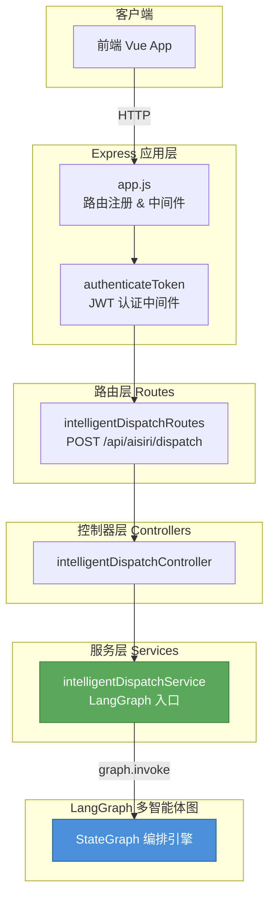

---

## 三、LangGraph 多智能体协同图（核心）

这是整个系统最关键的部分。用户输入通过 `intelligentDispatchService` 进入 LangGraph StateGraph，由以下节点按顺序 / 条件执行：

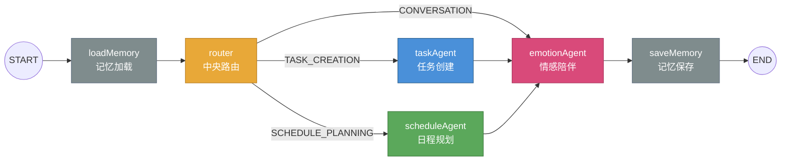

### 路由决策逻辑

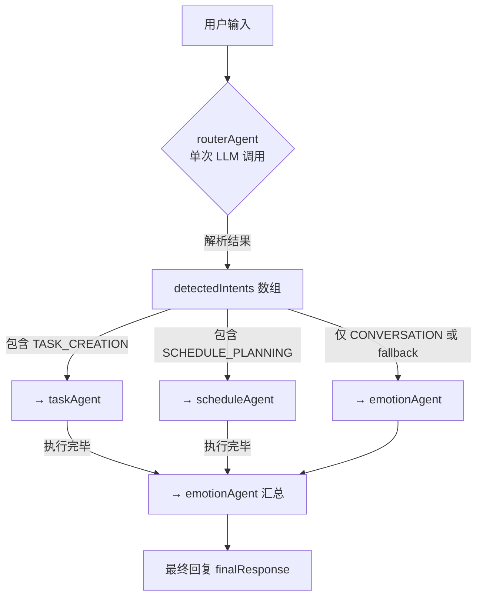

> **关键设计**：Router 支持多意图并行分发。例如"帮我创建明天下午3点开会的任务，再帮我规划一下今天的安排"会同时触发 `taskAgent` + `scheduleAgent`。

---

## 四、各智能体详细说明

### 4.1 共享状态 `AgentState`

所有智能体通过 LangGraph `Annotation.Root` 共享以下状态：

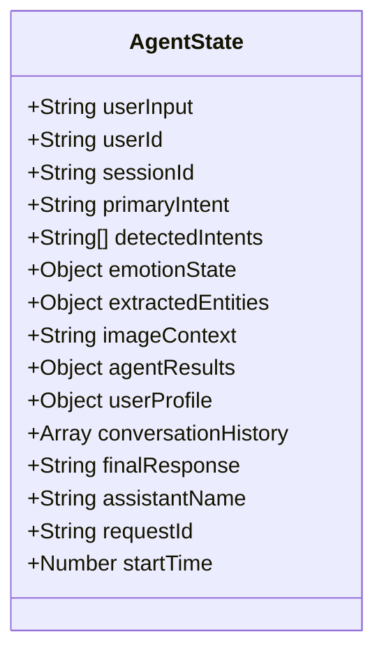

| 字段 | reducer | 说明 |
|------|---------|------|
| `userInput` | 覆盖 | 当前用户输入文本 |
| `primaryIntent` | 覆盖 | 主意图 |
| `detectedIntents` | 覆盖 | 所有检测到的意图数组 |
| `emotionState` | 覆盖 | `{emotion, confidence, triggers}` |
| `extractedEntities` | 覆盖 | `{tasks[], time, location, date}` |
| `agentResults` | **合并** | 各 agent 按 key 写入结果 |
| `userProfile` | 覆盖 | 用户画像（从 MongoDB 加载） |
| `finalResponse` | 覆盖 | 最终回复文本 |

---

### 4.2 RouterAgent — 中央路由

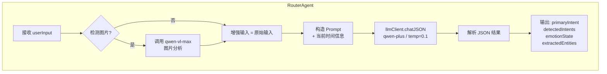

| 属性 | 值 |
|------|-----|
| **使用模型** | `qwen-plus`（通过 llmClient） |
| **Temperature** | 0.1 |
| **Max Tokens** | 800 |
| **输出格式** | 结构化 JSON |
| **核心能力** | 意图识别 + 情绪检测 + 实体提取（一次调用完成） |
| **图片处理** | 检测到图片 URL 时调用 `qwen-vl-max` 获取图片描述 |

**支持的意图类型（3 类）：**

| 意图 | 描述 | 触发示例 |
|------|------|----------|
| `TASK_CREATION` | 创建新任务 | "帮我记一下明天开会" |
| `SCHEDULE_PLANNING` | 日程规划/整理 | "帮我规划今天的安排" |
| `CONVERSATION` | 闲聊/情感交流 | "好累啊，不想上班" |

**支持的情绪类型（8 类）：**

| 情绪 | 描述 |
|------|------|
| `happy` | 开心、愉悦 |
| `sad` | 悲伤、低落 |
| `angry` | 愤怒、烦躁 |
| `anxious` | 焦虑、紧张 |
| `neutral` | 平静、无明显情绪 |
| `excited` | 兴奋、激动 |
| `tired` | 疲惫、倦怠 |
| `confused` | 困惑、迷茫 |

---

### 4.3 TaskAgent — 任务创建

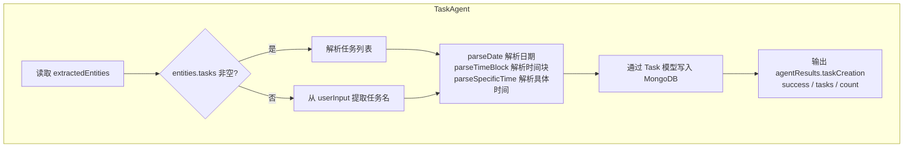

| 属性 | 值 |
|------|-----|
| **使用模型** | 无（纯规则引擎） |
| **数据库模型** | `Task`, `Collection` |
| **时间块** | morning / forenoon / afternoon / evening |
| **优先级** | 四象限分配 |

---

### 4.4 ScheduleAgent — 日程规划

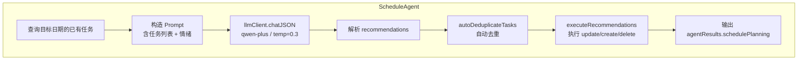

| 属性 | 值 |
|------|-----|
| **使用模型** | `qwen-plus`（通过 llmClient） |
| **Temperature** | 0.3 |
| **Max Tokens** | 1500 |
| **Timeout** | 45000ms |
| **操作类型** | update / reschedule / create / delete |
| **特殊功能** | 按标题+日期+时间自动去重 |

---

### 4.5 EmotionAgent — 情感陪伴

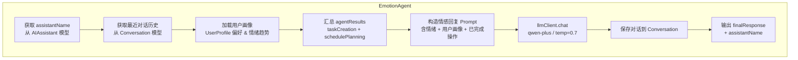

| 属性 | 值 |
|------|-----|
| **使用模型** | `qwen-plus`（通过 llmClient） |
| **Temperature** | 0.7（更有创造性） |
| **Max Tokens** | 500 |
| **核心职责** | 汇总所有 agent 结果，生成温暖、人格化的最终回复 |
| **数据持久化** | 用户消息 + AI 回复写入 `Conversation` 集合 |

**v2.0 新增能力：**

| 能力 | 说明 |
|------|------|
| **用户画像利用** | 从 `UserProfile` 读取用户偏好（如称呼习惯、语气偏好），个性化回复风格 |
| **情绪趋势感知** | 分析 `emotionHistory` 近期趋势，当连续负面情绪时主动增强关怀表达 |
| **交互深度意识** | 根据 `interactionCount` 区分新用户与老用户，调整回复的亲密度和引导方式 |

---

### 4.6 MemoryAgent — 记忆管理

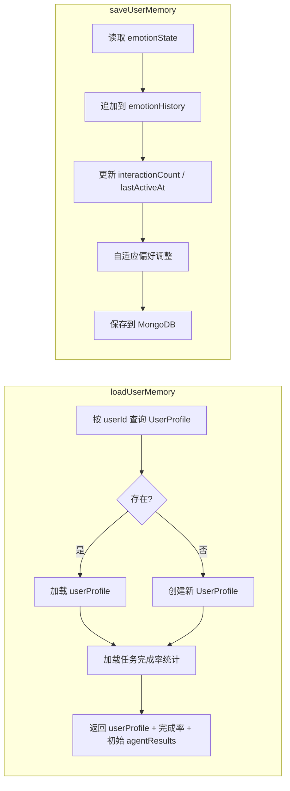

| 属性 | 值 |
|------|-----|
| **使用模型** | 无 |
| **数据库模型** | `UserProfile` |
| **保存内容** | 情绪历史、交互次数、最后活跃时间、用户偏好 |

**v2.0 新增能力：**

| 能力 | 说明 |
|------|------|
| **任务完成率加载** | `loadUserMemory` 阶段统计用户近期任务完成率，供下游 agent 参考（如日程建议强度） |
| **自适应偏好调整** | `saveUserMemory` 阶段根据交互模式自动更新用户偏好（如常用时间块、偏好的回复风格） |

---

## 五、LLM 调用链路

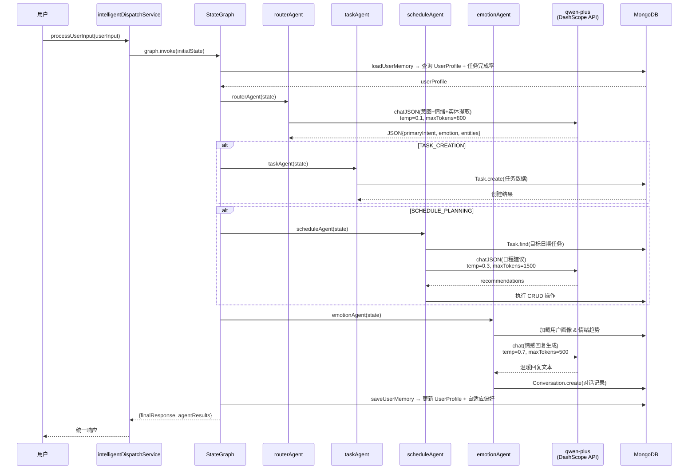

---

## 六、目录结构 & 文件职责

```
backend/src/AIsiri/
├── agents/                          # 🧠 LangGraph 多智能体核心
│   ├── state.js                     # 共享状态定义 (Annotation.Root)
│   ├── graph.js                     # StateGraph 编排 (Supervisor 模式)
│   ├── llmClient.js                 # 统一 LLM 客户端 (qwen-plus)
│   ├── routerAgent.js               # 中央路由 (意图+情绪+实体 一次提取)
│   ├── taskAgent.js                 # 任务创建 (规则引擎，无 LLM)
│   ├── scheduleAgent.js             # 日程规划 (LLM 生成建议 + DB 执行)
│   ├── emotionAgent.js              # 情感陪伴 (LLM 生成温暖回复 + 画像感知)
│   └── memoryAgent.js               # 记忆管理 (UserProfile 读写 + 自适应偏好)
│
├── services/                        # 📦 业务服务层（仅保留统一入口）
│   └── intelligentDispatchService.js # ★ LangGraph 入口，调用 graph.invoke()
│
├── controllers/                     # 🎮 请求处理器（仅保留统一入口）
│   └── intelligentDispatchController.js
│
├── routes/                          # 🛤️ API 路由
│   └── intelligentDispatchRoutes.js # POST /api/aisiri/dispatch
│
├── utils/                           # 🛠️ 工具
│   └── logger.js                    # Winston 日志 (按日轮转)
│
├── tests/                           # 🧪 测试
│   ├── latencyTest.js               # 多场景延迟测试
│   ├── intentTest.js                # 意图识别准确率测试
│   ├── emotionTest.js               # 情绪识别准确率测试
│   ├── userBehaviorTest.js          # 端到端用户行为模拟
│   ├── e2e-verify.sh               # 端到端验证脚本
│   └── testPlan.md                  # 测试方案文档
│
├── docs/                            # 📄 技术文档
│   └── 技术选型对比报告.md
│
└── logs/                            # 📋 运行日志 (运行时生成)
```

---

## 七、架构统一说明

系统已完成从"双通道并行"到"单一 LangGraph 通道"的架构统一。原有的旧架构（通道 B）中的独立服务已全部移除，所有请求统一经由 LangGraph StateGraph 处理。

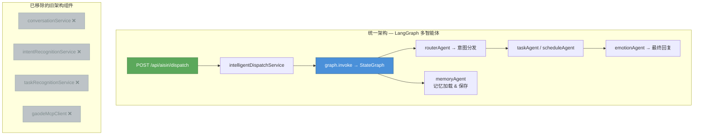

### 统一前后对比

| 能力 | 统一前（双通道） | 统一后（单通道） |
|------|------------------|------------------|
| 意图识别 | `routerAgent` + `intentRecognitionService` 冗余 | `routerAgent` 统一处理 |
| 情绪检测 | `routerAgent` + `conversationService.detectEmotion` 冗余 | `routerAgent` 统一处理 |
| 任务创建 | `taskAgent` + `taskRecognitionService` 冗余 | `taskAgent` 统一处理 |
| 对话生成 | `emotionAgent` + `conversationService` 冗余 | `emotionAgent` 统一处理 |
| 日程规划 | 仅通道 A | `scheduleAgent` |
| 用户记忆 | 仅通道 A | `memoryAgent` |

### 统一带来的收益

- **消除冗余**：移除 5 个旧服务文件，LLM 调用点从 5 处减少到 3 处
- **统一入口**：前端仅需对接 `/api/aisiri/dispatch` 单一端点
- **一致性**：所有用户输入经过相同的意图识别 → 任务处理 → 情感回复流程
- **可维护性**：代码量减少，调试链路清晰，Prompt 管理集中化

---

## 八、模型调用全景

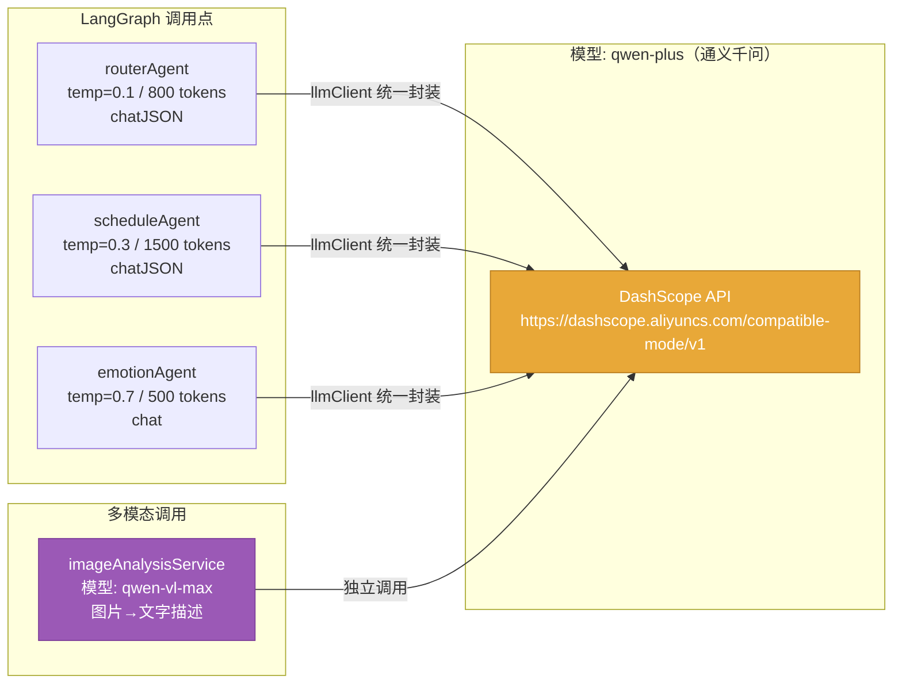

### LLM 调用汇总表

| 调用位置 | 模型 | 温度 | Max Tokens | 调用方式 | 输出格式 | 目的 |
|----------|------|------|------------|----------|----------|------|
| routerAgent | qwen-plus | 0.1 | 800 | llmClient.chatJSON | JSON | 意图+情绪+实体提取 |
| scheduleAgent | qwen-plus | 0.3 | 1500 | llmClient.chatJSON | JSON | 日程建议生成 |
| emotionAgent | qwen-plus | 0.7 | 500 | llmClient.chat | 自然语言 | 最终回复生成 |
| imageAnalysisService | qwen-vl-max | — | — | 独立调用 | 文字描述 | 图片内容分析 |

---

## 九、数据模型

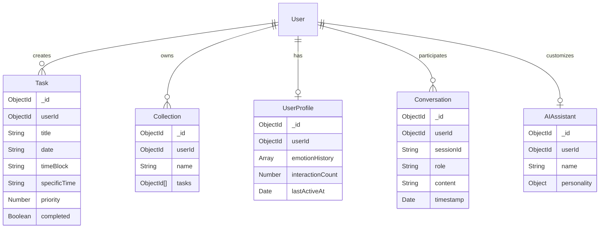

---

## 十、API 端点总览

| 路径 | 方法 | 认证 | 功能 |
|------|------|------|------|
| `/api/aisiri/dispatch` | POST | ✅ | 智能调度主入口（LangGraph 统一入口） |
| `/api/aisiri/dispatch/status` | GET | ❌ | 服务状态检查 |
| `/api/aisiri/dispatch/test` | POST | 可选 | 内置测试用例 |

---

## 十一、环境变量依赖

| 变量名 | 用途 | 使用位置 |
|--------|------|----------|
| `DASHSCOPE_API_KEY` | 通义千问 API 密钥 | llmClient（统一封装） |
| `MONGODB_URI` | MongoDB 连接串 | 全局数据库连接 |
| `JWT_SECRET` | JWT 签名密钥 | auth 中间件 |
| `OSS_REGION` | 阿里云 OSS 区域 | routerAgent（图片 URL） |
| `OSS_BUCKET` | 阿里云 OSS 存储桶 | routerAgent（图片 URL） |

---

## 十二、总结

AIsiri 的核心架构是基于 LangGraph.js 的 **Supervisor 多智能体协同系统**。系统已完成架构统一，原有的旧独立服务（通道 B）已全部移除，所有请求通过单一 LangGraph StateGraph 通道处理。当前架构包含 5 个核心智能体（routerAgent、taskAgent、scheduleAgent、emotionAgent、memoryAgent），通过 3 次 LLM 调用完成从意图识别到情感回复的全流程，具备良好的可扩展性和可维护性。
