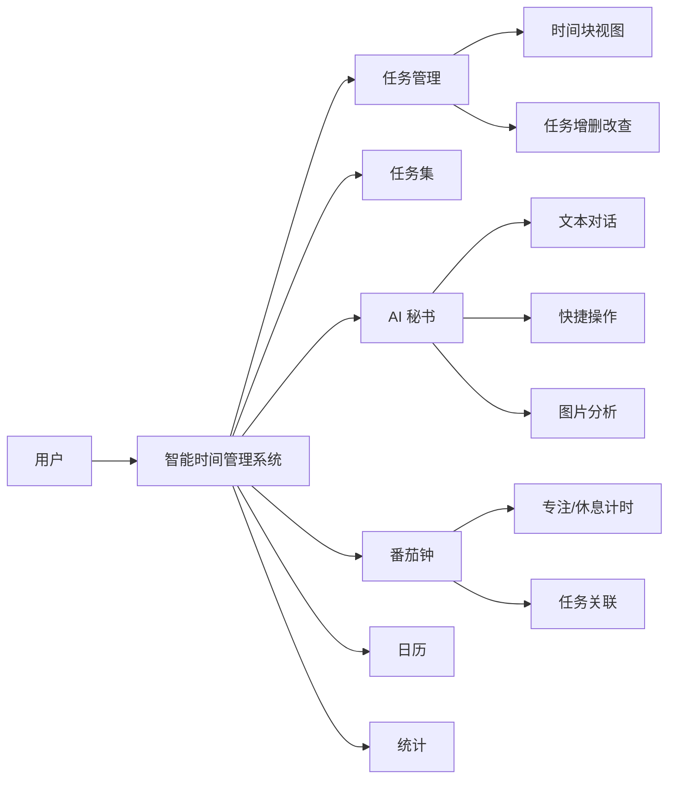
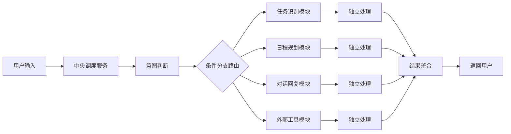

# 毕业设计中期答辩材料

## 1. 毕业设计工作是否更换题目及是否按开题报告预定的内容及进度安排进行

本毕业设计自开题以来未更换题目，整体研究内容始终围绕智能时间管理系统中的 AI 秘书模块展开，研究目标与开题报告保持一致。前期工作按照开题报告既定安排推进，已按时完成系统需求梳理、相关技术调研、AI 秘书原型分析、初步框架设计及阶段性功能验证等内容，整体进度正常，符合中期检查要求。

## 2. 目前已完成的研究工作及结果

目前已完成的研究工作，主要集中在智能时间管理系统的整体设计与开发、AI 秘书模块的前期实现、`LangChain + OpenClaw` 框架学习与 Demo 搭建，以及典型功能场景的实验验证等方面。

### （1）系统概述与功能实现

本课题实现了一套面向个人用户的智能时间管理系统。系统采用前后端分离架构，前端基于 Vue 3 框架开发，后端基于 Node.js/Express 搭建，数据持久化使用 MongoDB。系统整体采用移动端优先的单页应用设计，通过底部导航栏组织各功能入口，为用户提供任务管理、日程规划、专注计时、数据统计和 AI 智能辅助等一站式时间管理能力。

系统整体功能架构如图 1 所示。

图 1 系统整体功能架构图

目前系统已完成的主要功能模块及其核心能力如表 1 所示。

| 功能模块 | 核心能力 | 说明 |
|----------|----------|------|
| 任务管理 | 任务创建、完成、删除；支持时间块视图（按早上/下午/晚上分组）和四象限视图（按重要-紧急程度分类） | 系统默认首页 |
| 任务集 | 将多个相关任务组织为一个集合，支持子任务管理和完成进度展示 | 适用于项目或阶段性目标管理 |
| AI 秘书 | 文本对话、语音输入、图片分析；支持快捷操作（创建任务、安排日程、目标规划、习惯养成、情绪支持） | 本课题核心研究模块 |
| 番茄钟 | 专注 25 分钟、短休息 5 分钟、长休息 15 分钟三种模式；支持与具体任务关联，记录每日完成番茄数 | 从任务页或日历页点击任务进入 |
| 日历 | 周视图与月视图切换，按日期展示任务分布，支持日期间切换浏览 | 提供时间维度的任务概览 |
| 统计 | 累计专注次数与时长、当日专注数据、专注时段分布等 | 帮助用户量化专注投入 |
| 用户认证 | 注册、登录、用户信息管理，路由守卫与 Token 校验 | 系统基础能力 |

### （2）系统界面展示

系统主要界面截图如下所示。

**任务管理页面（时间块视图 / 四象限视图）：**

<!-- TODO: 插入任务管理页面截图 -->

**AI 秘书对话页面：**

<!-- TODO: 插入 AI 秘书对话界面截图 -->

**番茄钟专注页面：**

<!-- TODO: 插入番茄钟页面截图 -->

**日历页面：**

<!-- TODO: 插入日历页面截图 -->

**统计页面：**

<!-- TODO: 插入统计页面截图 -->

### （3）AI 秘书模块前期实现

在系统整体功能完成的基础上，本课题重点围绕 AI 秘书模块展开了前期研究与实现工作。

AI 秘书前期版本以中央调度服务为核心，通过关键词检测、简单意图判断和条件分支路由，将用户输入分别分发到任务识别、日程规划、对话回复和外部工具查询等模块中处理，形成了一个可运行的 AI 秘书原型。该原型已经能够支持任务创建、日程建议、日常对话、情绪回复和基础工具查询等常见使用场景。

同时，已围绕 `LangChain + OpenClaw` 开展了前期框架学习与实践。其中，`LangChain` 主要用于理解大语言模型调用、提示词组织、链式处理和任务编排等基础思路；`OpenClaw` 则主要用于学习多模块协作和智能体工作流组织方式。在此基础上完成了相关 Demo 的搭建，并针对 AI 秘书场景进行了初步验证，说明将大模型能力引入时间管理系统具有较好的可行性。

AI 秘书前期版本的处理流程如图 2 所示。

图 2 AI 秘书前期版本调度流程图

### （4）实验方案

为验证系统各模块的可用性及 AI 秘书前期版本的可行性，本课题围绕典型用户场景设计了实验方案，通过构造代表性输入，观察系统在路由、调用和输出环节的执行效果。主要实验方案如表 2 所示。

| 实验项目 | 实验内容 | 观察指标 |
|----------|----------|----------|
| 任务创建实验 | 输入包含具体时间和事项的自然语言任务 | 能否识别任务信息并完成创建 |
| 日程规划实验 | 输入"查看今日任务""安排今天日程"等请求 | 能否完成任务整理和日程建议输出 |
| 对话交互实验 | 输入情绪表达或普通聊天语句 | 能否生成自然、连贯的对话回复 |
| 工具调用实验 | 输入天气、路线等查询请求 | 能否正确进入对应工具服务并返回结果 |
| 前后端联调实验 | 全链路接口调用与页面交互验证 | 能否形成完整业务闭环并稳定返回 |
| 番茄钟关联实验 | 从任务进入番茄钟并记录专注数据 | 任务与专注记录能否正确关联 |

### （5）实验结果与分析

根据已完成的功能联调和典型场景测试，系统各模块已取得较为明确的阶段性结果。主要实验结果如表 3 所示。

| 测试场景 | 预期目标 | 实验结果 |
|----------|----------|----------|
| 输入具体事项与时间 | 完成任务识别与创建 | 已实现，任务可正确出现在对应时间块 |
| 输入查看或整理日程请求 | 输出任务列表或安排建议 | 已实现基础日程规划能力 |
| 输入普通对话或情绪表达 | 输出自然语言回复 | 已实现基础对话交互能力 |
| 输入工具查询请求 | 调用工具服务并返回结果 | 已实现基础工具调用能力 |
| 前后端全链路联调 | 接口调用与页面交互正常 | 已形成完整原型闭环 |
| 番茄钟与任务关联 | 点击任务进入番茄钟并记录 | 已实现，专注数据正确归属对应任务 |

为进一步定量化描述本阶段成果，系统已完成指标归纳为表 4。

| 指标项 | 当前结果 | 说明 |
|--------|----------|------|
| 系统功能模块数 | 7 个 | 任务管理、任务集、AI 秘书、番茄钟、日历、统计、用户认证 |
| 系统页面数 | 7 个 | 对应 7 个独立视图页面 |
| 前端组件数 | 20+ | 含业务组件与通用组件 |
| 已具备业务接口规模 | 40+ | 涵盖任务、用户、番茄钟、任务集、AI 等全部接口 |
| AI 秘书支持的交互方式 | 3 种 | 文本输入、语音输入、图片分析 |
| AI 秘书快捷操作类型 | 5 类 | 创建任务、安排日程、目标规划、习惯养成、情绪支持 |
| AI 秘书核心功能链路 | 4 类 | 任务创建、日程规划、对话回复、工具查询 |
| 前期版本对话历史保留能力 | 最近 10 条 | 已具备基础上下文保留能力 |
| 对话场景 LLM 调用次数 | 2-3 次 | 由意图判断和回复生成等环节构成 |
| 任务/日程场景 LLM 调用次数 | 4-5 次 | 不同服务模块独立调用，调用成本较高 |

从实验结果可以看出，系统已经完成了全部基础功能模块的开发，各模块之间能够正常协同工作，形成了完整的业务闭环。AI 秘书前期版本已经具备基础的意图识别与任务处理能力，能够在典型场景下完成用户请求的理解与执行。同时，实验结果也表明 AI 秘书在模块协同、路由灵活性和调用效率等方面仍存在优化空间，这些发现为后续研究提供了明确方向。

## 3. 后期拟完成的研究工作及进度安排

后期工作将在现有 Demo 和已有实现基础上继续展开，重点以"完善已有功能、提升系统稳定性、补充测试结果和完成论文撰写"为主，不再进行过大范围的技术扩展，整体安排较为可行。

首先，将继续完善 AI 秘书模块现有的自动路由与任务处理能力。结合当前已经实现的调度流程，进一步优化用户输入识别、任务创建、任务整理、日程安排和情绪回复等功能，使系统在常见场景下的处理结果更加稳定、准确。对于目前已经实现的一些功能点，如任务去重、优先级调整、状态隔离和快捷交互流程等，后续也将继续进行细化和完善。

其次，将继续对现有系统进行联调和测试。重点围绕典型使用场景展开，例如任务创建、日程安排、情绪陪伴、任务整理以及多轮对话等，进一步观察系统在真实使用过程中的表现，整理实验现象与测试结果，为论文中的系统实现与实验分析部分提供支撑材料。

再次，将在现有研究和实现基础上同步推进论文写作工作。后续将结合前期调研、框架探索、Demo 搭建情况以及已有功能实现过程，逐步完成论文中需求分析、系统设计、关键实现、测试分析和总结展望等部分内容。

后期进度安排如下：

| 时间安排 | 拟完成内容 |
|----------|------------|
| 中期答辩后第 1 阶段 | 在现有实现基础上继续优化自动路由、任务处理和交互流程 |
| 中期答辩后第 2 阶段 | 开展系统联调与典型场景测试，整理实验结果 |
| 中期答辩后第 3 阶段 | 完成论文正文撰写、修改和定稿准备 |

从目前进展来看，后续工作主要是在已有成果基础上的完善与总结，任务安排较为明确，实施难度可控，具有较强可行性。

## 4. 存在的困难与问题

当前研究过程中存在的主要困难，集中体现在用户意图的自动识别与路由，以及 AI 秘书整体框架设计两个方面。

一方面，用户输入往往具有自然语言表达灵活、语义边界不清晰、单次输入包含多重意图等特点。例如，用户一句话中可能同时包含任务创建、日程安排和情绪表达等内容，这就对系统的意图识别与自动路由能力提出了更高要求。如果路由策略设计不够合理，容易出现误判、漏判或执行顺序不当的问题，从而影响系统输出质量。

另一方面，在 AI 秘书框架设计上，如何实现多个模块之间高效协同，也是当前的一个重点难点。系统不仅需要考虑各功能模块的职责划分，还需要解决状态共享、上下文传递、执行顺序控制、结果整合以及异常处理等问题。尤其是在从原有较简单的调用逻辑向多智能体协同架构过渡的过程中，如何兼顾系统复杂度、实现成本与研究进度，是需要持续权衡和优化的关键问题。

此外，在个性化输出方面，情绪信息、任务结果和上下文记忆之间的融合机制仍需进一步完善。如何让系统在保证执行准确性的同时，兼顾回应的自然性、连续性和个体差异，也是后续研究需要继续解决的问题。

## 5. 如期完成全部论文工作的可能性

从目前的研究进展、系统基础和后续计划来看，本课题具备如期完成全部论文工作的条件。当前前期调研、问题分析和初步框架设计工作已经完成，后续研究目标明确、实现路径清晰，且项目已有较好的系统基础与开发积累。只要按照既定计划继续推进系统优化、测试验证与论文撰写工作，预计可以正常完成毕业设计全部任务，并按时提交论文及参加最终答辩。
